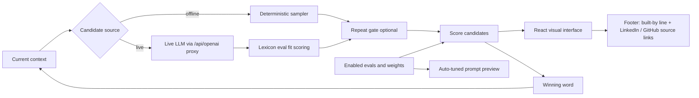
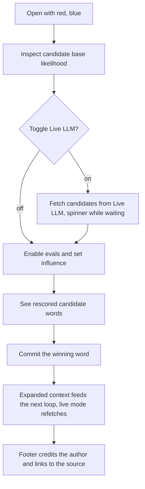

# Architecture

The app keeps the evaluation domain separate from the React view. There are
two candidate sources: a transparent deterministic sampler (offline default)
and a Live LLM accessed through a backend-selected OpenAI-compatible provider.
In both cases eval scoring and winner selection happen client-side in the
models layer, so a viewer can trace exactly why one continuation wins.

The frontend posts a model-free OpenAI Chat Completions request to the
same-origin `/api/openai/chat/completions` route. The shared deployment backend
keeps `OPENAI_API_BASE`, `OPENAI_API_KEY`, and `OPENAI_MODEL` server-side,
injects the selected model, and enforces
`metadata.completion_window = "balanced"`. No provider configuration enters
the browser bundle. The standard response includes the actual model at the top
level and generated content at `choices[0].message.content`. Live mode makes
one structured-output request per loop step; eval sliders rescore the
already-fetched candidates locally.

## User journey

## Modules

- `app/src/models/evalLoop.ts` — candidate scoring, winner selection, prompt
  preview construction, deterministic sampler, and the repeat gate
  (`filterRepeats`): a hard deterministic gate that drops candidates already
  in the context, illustrating gate-vs-pressure. It is a UI toggle (default
  on) because repetition is sometimes legitimate (americana: red, white,
  blue, white…), and it falls back to the unfiltered list rather than
  returning zero candidates.
- `app/src/models/evalFit.ts` — rule-based (lexicon) evaluators that score any
  word's fit per eval, with a human-readable reason. The $0/instant evaluator
  class, in contrast to an LLM-as-judge.
- `app/src/models/llmCandidates.ts` — builds a model-agnostic structured-output
  request, parses/normalizes the standard Chat Completions response, and
  fetches via the shared proxy. The backend owns provider and model selection.
  By default the
  generation prompt is neutral, so evals act purely as downstream selection
  pressure — which cannot inject a theme the model never proposes. A toggle
  in the prompt panel closes the auto-tuning loop: the steering block
  (`buildSteering`) is sent with each live request, shaping proposals
  upstream. The chip in the candidates panel shows which regime is active
  (offline sampler / live / live+steered).
- `app/src/App.tsx` — interactive state and rendering only; owns the
  source toggle, loading and error states.
- `app/src/Footer.tsx` — pure presentational footer rendered at the bottom
  of the page; a "Built by John Pfeiffer" line with LinkedIn and GitHub
  source links (`@mui/icons-material` marks). Covered by a jsdom component
  test (`Footer.test.tsx`).
